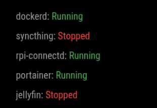

# MMM-ProcessStatus
This is a module for the [MagicMirror²](https://github.com/MichMich/MagicMirror/).




This module will display desired processes status either running or stopped.

## Installation

In your terminal, go to your MagicMirror's Module folder:

```bash
cd ~/MagicMirror/modules
```

Clone this repository:

```bash
git clone https://github.com/modo-github/MMM-ProcessStatus

```
## Using the module

To use this module, add the following configuration block to the modules array in the `config/config.js` file:

Change position as normal and in processes list them as named in ps aux
```js
{
    module: "MMM-ProcessStatus",
    position: "top_left", 
    config: {
        processes: ["syncthing", "dockerd", "rpi-connectd","portainer","jellyfin"],
    }
},

```

## Supported hardware
- Raspberry Pi cm5 (tested)
- Probably works on other Raspberry Pi's

- Mostly ai slop as I don't know JS,CSS but it works and might be handy for someone else. 
